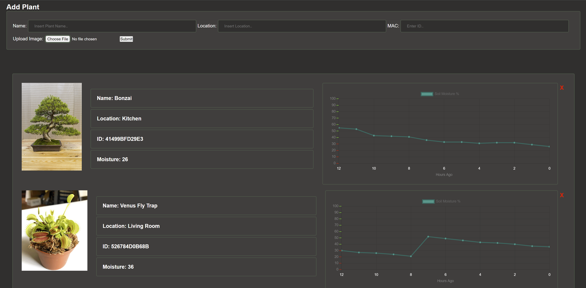

  

I am currently attending the University of Iowa for Computer Science & Engineering.

* 🖥️  See my portfolio at [repositories](http://github.com/Nick-Hageman?tab=repositories)
* ✉️  You can contact me at [nicholas-hageman@uiowa.edu](mailto:nicholas-hageman@uiowa.edu)
* 🚀  I'm currently working on a [Real Estate Website](http://ec2-34-207-204-243.compute-1.amazonaws.com:5000/index.html)
* 🤝  I'm open to collaborating on Hackathon projects

### Skills

 

 

### Socials

  
  

<h1>Recent Projects</h1>

<h3>Real Estate Business Website</h3>
-	Developed web application for home builder to expand marketing and customer communication  
-	Utilized LiDAR technology to capture and render interactive 3D floorplans of available homes  
-	Implemented an interactive satellite map to display available properties to customers  
-	Containerized the application using Docker in an AWS EC2 hosting environment   

https://user-images.githubusercontent.com/91749467/213323324-417451a5-0ce0-4a86-a23c-b683bd9444f7.mp4

https://user-images.githubusercontent.com/91749467/213325228-1086373e-a8f2-4b1a-9282-2d1d30bdb63a.mp4

<h3>IoT Web Application</h3>
-	Developed an IoT Web Application to monitor soil moisture levels in real time  
-	Created REST API's to send & receive data from a microcontroller  
-	Presented data from a relational database using a JavaScript graphing API   

<h3>ENGR:2730 Computers in Engineering</h3>
-	Added features to "Asteroids" using topics of C++ learned in class including: 
-	OOP, dynamic memory allocation, SFML library, composition, inheritance, and polymorphism  
-	Extra Credit: Implemented final boss round, enemy tracking (movement & aim), shield capabilities and ability to reset game   

https://user-images.githubusercontent.com/91749467/204119375-712531aa-f3ae-4c50-93f5-bc627e1bd36e.mp4

