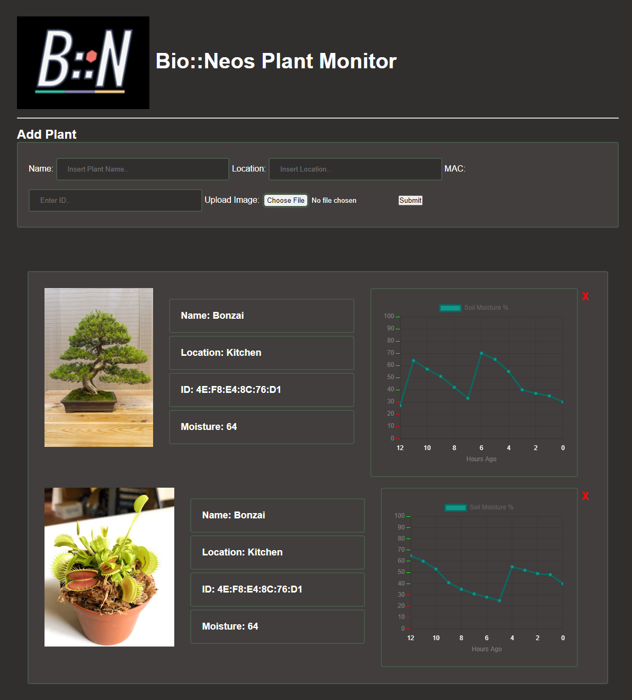

Hi My name is Nick Hageman
====================================================================================================================================

I am currently attending the university of Iowa for Computer Science & Engineering.

* 🖥️  See my portfolio at [repositories](http://github.com/Nick-Hageman?tab=repositories)
* ✉️  You can contact me at [nicholas-hageman@uiowa.edu](mailto:nicholas-hageman@uiowa.edu)
* 🚀  I'm currently working on a Real Estate Website
* 🤝  I'm open to collaborating on Hackathon projects

### Skills

### Socials

  

<h1>Recent Projects</h1>

<h3>Real Estate Business Website</h3>
-	Developed web application for home builder to expand marketing and customer communication  
-	Utilized an embedded map to display available properties to customers  
-	Captured and edited drone footage to showcase available houses   

https://user-images.githubusercontent.com/91749467/194215127-e8a49729-03f4-44fc-84eb-2033c2a42c5a.mp4

<h3>IoT Web Application</h3>
-	Developed an IoT Web Application to monitor soil moisture levels in real time  
-	Created REST API's to send & receive data from a microcontroller  
-	Presented data from a relational database using a JavaScript graphing API   

